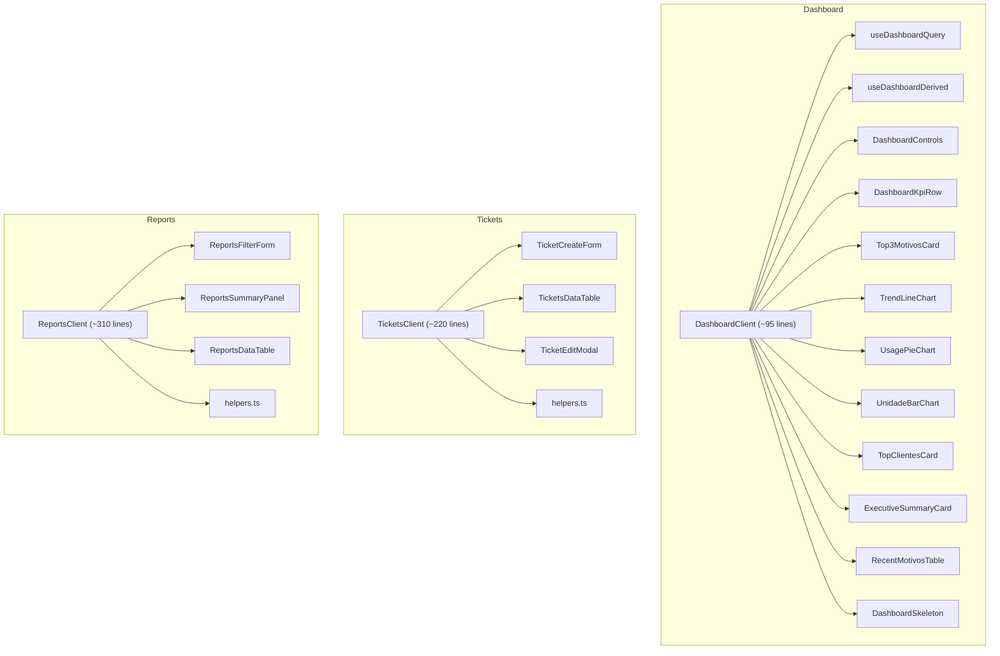
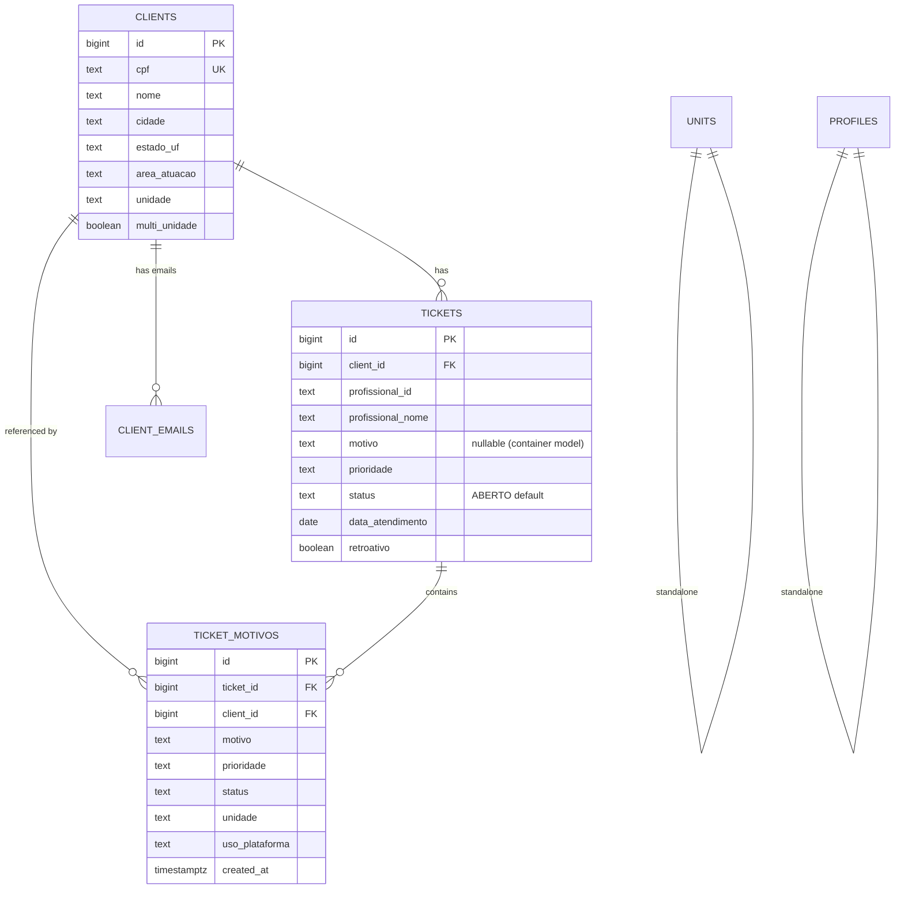

# Taskflow Reports — Technical Audit Report

> **Updated:** February 2026 · **Stack:** Next.js 16 (App Router) · React 19 · Supabase (PostgreSQL) · TailwindCSS v4 · HeroUI / Radix · Recharts

---

## 1 · Executive Summary

Taskflow Reports is an internal ticketing & analytics platform designed around a **container model** — each client may have at most one active ticket, and individual support events are captured as `ticket_motivos` (motives) under that ticket.

The codebase has undergone a **major structural refactoring (Phase 1 & 2)** since the initial audit. The monolithic client components have been decomposed into focused subcomponents and custom hooks, a design-system UI library (`app/ui/`) with 31 components has been established, and a proper sidebar/layout infrastructure has been implemented. The architecture is now **well-organized and maintainable**. However, the **security gaps** and **performance scalability concerns** from the original audit remain open and should be addressed before scaling.

### Overall Health Scorecard

| Area | Score | Verdict |
|---|:---:|---|
| Architecture & Organization | ★★★★★ | Excellent App Router patterns; decomposed components; custom hooks; layout infrastructure |
| Security | ★★☆☆☆ | RLS is effectively disabled; no middleware guard; no rate-limiting |
| Database Design | ★★★★☆ | Well-indexed; smart partial index for deduplication |
| Performance & Scalability | ★★★☆☆ | In-memory aggregation caps at 6 k rows; no SSR caching strategy |
| Code Quality & Maintainability | ★★★★☆ | Decomposed components; helper modules; some utility duplication remains |
| UX & Frontend | ★★★★★ | Design-system tokens; loading skeletons; dark-mode; collapsible sidebar; breadcrumbs |

---

## 2 · Architecture

### 2.1 Strengths

- **App Router best practices:** Pages are RSC (React Server Components) that fetch data on the server and pass props to `*Client.tsx` companions.
- **Server Actions for mutations:** [createTicketAction](file:///c:/Users/USER/Desktop/taskflow-reports%20-%20WEB/app/tickets/actions.ts), [updateTicketAction](file:///c:/Users/USER/Desktop/taskflow-reports%20-%20WEB/app/tickets/actions.ts), [addMotivoAction](file:///c:/Users/USER/Desktop/taskflow-reports%20-%20WEB/app/tickets/actions-motivos.ts) keep mutation logic server-side.
- **Container ticket model:** A partial unique index (`tickets_client_active_uidx`) enforces ≤1 active ticket per client at the DB level.
- **Single source of truth for constants:** [constants.ts](file:///c:/Users/USER/Desktop/taskflow-reports%20-%20WEB/app/tickets/constants.ts) mirrors SQL `CHECK` constraints.
- **Component decomposition:** All three main views (Dashboard, Tickets, Reports) follow the orchestrator + subcomponents pattern with custom hooks.
- **Layout infrastructure:** `AppShellClient` with `SidebarContext`, `SidebarNav` (desktop + mobile drawer), `AppHeader` (with Ctrl+B shortcut), and breadcrumb navigation.
- **Design system:** 31 UI components in `app/ui/` with consistent tokens, dark-mode support, and responsive patterns.

### 2.2 Current Component Architecture



### 2.3 Remaining Risks

| Risk | Severity | Detail |
|---|:---:|---|
| **No middleware.ts** | 🔴 Critical | No Next.js middleware to guard routes at the edge. API routes like `/api/dashboard/metrics` perform **no auth check**. |
| **API routes bypass auth** | 🔴 Critical | [route.ts (metrics)](file:///c:/Users/USER/Desktop/taskflow-reports%20-%20WEB/app/api/dashboard/metrics/route.ts) fetches data without verifying the user session. Same for `/api/client/lookup` and `/api/client/upsert`. |
| **Reports queries legacy table** | 🟡 Medium | [ReportsClient.tsx](file:///c:/Users/USER/Desktop/taskflow-reports%20-%20WEB/app/reports/ReportsClient.tsx) queries the `tickets` table directly, but the dashboard centers on `ticket_motivos`. |
| **Legacy RPC not retired** | 🟢 Low | [dashboard_rpc.sql](file:///c:/Users/USER/Desktop/taskflow-reports%20-%20WEB/supabase/dashboard_rpc.sql) defines an unused `dashboard_metrics` function. Dead code in the DB. |

---

## 3 · Security

### 3.1 Row Level Security — Effectively Disabled

> [!CAUTION]
> Every table (`tickets`, `ticket_motivos`, `clients`, `client_emails`, `units`, `profiles`) has RLS **enabled** but uses `using(true)` / `with check(true)`. **Any authenticated user can read, insert, update, and delete any row** — including other professionals' tickets and all client PII.

**Evidence:** [schema.sql L350-399](file:///c:/Users/USER/Desktop/taskflow-reports%20-%20WEB/supabase/schema.sql#L350-L399).

### 3.2 No Route-Level Auth Guard

Without `middleware.ts`, protected routes depend on each page/API calling `getUser()` individually. If a developer forgets this check, the route is silently unprotected.

### 3.3 Input Validation Gaps

| Location | Issue |
|---|---|
| [addMotivoAction](file:///c:/Users/USER/Desktop/taskflow-reports%20-%20WEB/app/tickets/actions-motivos.ts) | Relies on DB CHECK constraints; a malformed payload produces a raw Postgres error. |
| [upsertClientAction](file:///c:/Users/USER/Desktop/taskflow-reports%20-%20WEB/app/clients/actions.ts) | CPF validated only by length (11 digits); no checksum. |
| [lookupClientAction](file:///c:/Users/USER/Desktop/taskflow-reports%20-%20WEB/app/clients/actions.ts) | Name search uses `.ilike()` with no length cap on wildcard pattern. |

### 3.4 CPF Exposure

- CPF is partially masked in exports — **good**.
- However, the full 11-digit CPF is returned to the browser in client lookup responses. Under LGPD, this should be minimized.

### 3.5 Recommendations

1. **Add `middleware.ts`** with session guard and allow-list for `/login` and public assets.
2. **Implement proper RLS** restricting by `auth.uid()` linked to `profiles.id`.
3. **Add a validation layer** (Zod schemas) at the boundary of each server action/API route.
4. **Rate-limit** API routes — especially client lookup (prevents enumeration attacks on CPF/email).

---

## 4 · Database

### 4.1 Strengths

- **Partial unique index** for active ticket deduplication.
- **Dedicated indexes** on `ticket_motivos` for dashboard queries.
- **Idempotent migrations** using `CREATE … IF NOT EXISTS`.
- **CHECK constraints** match application constants.
- **`client_emails` table** with `email_norm` + unique constraint.

### 4.2 Risks

| Risk | Detail |
|---|---|
| **No `updated_at` trigger** | Both `tickets` and `ticket_motivos` have `updated_at` columns but **no trigger** to auto-update them. |
| **Unordered migrations** | 19 SQL files with no numbered prefix or migration tracking. |
| **Duplicate motivo enum** | Same 24+ motivos list appears in 3 SQL files + `constants.ts`. |
| **`profissional_id` as text** | No foreign key to `profiles`; data can become inconsistent. |

### 4.3 Schema Diagram



---

## 5 · Performance & Scalability

### 5.1 Dashboard In-Memory Aggregation

[route.ts](file:///c:/Users/USER/Desktop/taskflow-reports%20-%20WEB/app/api/dashboard/metrics/route.ts) fetches **up to 6,000 rows** from `ticket_motivos`, then aggregates entirely in JavaScript. This works for low traffic but will hit a wall at ~100 motivos/day.

> [!WARNING]
> At ~100 motivos/day, the 6 k limit will be reached in roughly 60 days for a 90-day period query.

**Recommendation:** Migrate aggregation to a Postgres RPC or materialized view.

### 5.2 No Cache Strategy

- API route uses `revalidate: 60` but the client fetches with `cache: "no-store"`, bypassing it.
- No Redis, `unstable_cache`, or SWR.

### 5.3 Bundle Size

- `xlsx` (SheetJS) is imported synchronously (~400 KB gzipped).
- **Recommendation:** Lazy-import `xlsx` only when the user clicks "Export".

---

## 6 · Code Quality & Maintainability

### 6.1 ✅ Resolved — Component Decomposition

> [!TIP]
> **Previously flagged as a major issue.** The three monolithic client components have been successfully decomposed:
>
> | Component | Before | After | Subcomponents |
> |---|:---:|:---:|:---:|
> | DashboardClient | ~718 lines | ~95 lines | 10 components + 2 hooks |
> | TicketsClient | ~1,540 lines | ~220 lines | 3 components + helpers |
> | ReportsClient | ~898 lines | ~310 lines | 3 components + helpers |

### 6.2 ✅ Partially Resolved — Utility Extraction

Domain-specific helpers have been extracted into dedicated modules:

- `app/tickets/helpers.ts` — `formatCpf`, `maskCpf`, date formatters, `motivoTone`
- `app/reports/helpers.ts` — date parsing/formatting, input masks, filename builder, `priorityTone`
- `app/dashboard/helpers.ts` — `formatNumber`, `formatPercent`, `formatRelative`

**Remaining duplication:** `formatDateBR`, `maskCpf`, `pad`, `escapeCsvValue` still appear in both `utils/exportReports.ts` and `utils/exportTickets.ts`. These should be consolidated into shared `utils/format.ts` and `utils/csv.ts`.

### 6.3 ✅ Resolved — Layout Infrastructure

The AppShell pattern has been fully implemented with:
- `SidebarContext` with expand/collapse/hide + localStorage persistence
- `SidebarNav` (desktop + mobile drawer)
- `AppHeader` with toggle button and `Ctrl+B` keyboard shortcut
- `AppShellClient` composing all layout pieces

### 6.4 ✅ Resolved — Loading States

Dashboard now has `DashboardSkeleton` with skeleton cards and chart placeholders. Tickets and Reports pages have `loading.tsx` with skeleton screens.

### 6.5 Zero Test Coverage

> [!IMPORTANT]
> The project still has **no test files**. No testing framework is configured. Every deployment relies entirely on manual verification.

### 6.6 Type Safety Gaps

- Type assertions (`as any`) appear in ticket motivos filtering.
- Supabase response types are manually cast (`Array.isArray(t.clients) ? t.clients[0] : t.clients`) — repeated 6+ times.
- **Recommendation:** Generate types with `supabase gen types`.

### 6.7 Error Handling Inconsistency

Four different error-propagation patterns coexist: `throw new Error(...)` with custom `.code`, redirect with error param, return `{error: string}` JSON, and raw Supabase error throws. **Recommendation:** Standardize on a `Result<T>` pattern.

### 6.8 No Error Monitoring

No Sentry, DataDog, or equivalent. Server-side errors in production are invisible.

---

## 7 · UX & Frontend

### 7.1 Strengths

- **Design system:** 31 UI components in `app/ui/` with CSS custom properties (`--color-bg`, `--color-surface`, etc.), dark/light mode.
- **Responsive layout:** Collapsible sidebar, mobile navigation drawer, proper breakpoints.
- **Loading skeletons:** Dashboard, tickets, and reports all have skeleton loading states.
- **BOM-prefixed CSV export** for correct encoding in Excel.
- **CPF masking in exports.**
- **Breadcrumb navigation.**
- **Chart expand modal** for full-screen chart viewing.

### 7.2 Remaining Opportunities

- **No optimistic UI:** Server actions wait for completion before updating.
- **Accessibility:** Custom components may lack `aria-` attributes and keyboard navigation (HeroUI provides some, but custom elements like the sidebar may not).

---

## 8 · Prioritized Improvement Plan

### 🔴 P0 — Security (Do Immediately)

| # | Action | Effort | Impact |
|:---:|---|:---:|:---:|
| 1 | Add `middleware.ts` with session guard | Small | Prevents unauthenticated access |
| 2 | Add `getUser()` check to all API routes | Small | Closes auth gap |
| 3 | Replace `using(true)` RLS with `auth.uid()` checks | Medium | Prevents cross-user data access |

### 🟡 P1 — Data Integrity & Reliability (Next Sprint)

| # | Action | Effort | Impact |
|:---:|---|:---:|:---:|
| 4 | Add `updated_at` trigger on `tickets` and `ticket_motivos` | Small | Timestamp reliability |
| 5 | Migrate ReportsClient to query `ticket_motivos` | Medium | Aligns reports with current model |
| 6 | Add Zod validation schemas for all server actions | Medium | Structured input validation |
| 7 | Set up Vitest + basic tests for server actions | Medium | Catches regressions |

### 🟢 P2 — Performance & Scalability (Quarter)

| # | Action | Effort | Impact |
|:---:|---|:---:|:---:|
| 8 | Move dashboard aggregation to Postgres RPC | Large | Removes 6 k row limit |
| 9 | Lazy-load `xlsx` library on export click | Small | Reduces bundle ~400 KB |
| 10 | Add `unstable_cache` or SWR for dashboard data | Medium | Reduces redundant fetches |

### 🔵 P3 — Code Quality (Ongoing)

| # | Action | Effort | Impact |
|:---:|---|:---:|:---:|
| 11 | ~~Break monolithic components into sub-components~~ | ~~Medium~~ | ✅ Done |
| 12 | Consolidate remaining duplicate utils (`formatDateBR`, `maskCpf`, `escapeCsvValue`) | Small | Eliminates last duplication |
| 13 | Generate Supabase types (`supabase gen types`) | Small | Eliminates manual casts |
| 14 | Standardize error handling pattern | Medium | Consistent error UX |
| 15 | Remove unused [dashboard_rpc.sql](file:///c:/Users/USER/Desktop/taskflow-reports%20-%20WEB/supabase/dashboard_rpc.sql) | Small | Reduces dead code |
| 16 | Number SQL migrations and adopt a migration runner | Medium | Reproducible DB setup |
| 17 | Add Sentry or equivalent error monitoring | Small | Production visibility |

---

## 9 · Current Project Structure

```
app/
├── dashboard/
│   ├── DashboardClient.tsx          (~95 lines — orchestrator)
│   ├── useDashboardQuery.ts         (data fetching hook)
│   ├── useDashboardDerived.ts       (memoized derived data hook)
│   ├── helpers.ts                   (formatting utilities)
│   ├── types.ts                     (domain types & constants)
│   └── components/
│       ├── DashboardControls.tsx
│       ├── DashboardKpiRow.tsx
│       ├── DashboardSkeleton.tsx
│       ├── ExecutiveSummaryCard.tsx
│       ├── RecentMotivosTable.tsx
│       ├── Top3MotivosCard.tsx
│       ├── TopClientesCard.tsx
│       ├── TrendLineChart.tsx
│       ├── UnidadeBarChart.tsx
│       └── UsagePieChart.tsx
├── tickets/
│   ├── TicketsClient.tsx            (~220 lines — orchestrator)
│   ├── helpers.ts                   (CPF, date, motivo utilities)
│   ├── types.ts, constants.ts, error-messages.ts
│   └── components/
│       ├── TicketCreateForm.tsx      (self-contained create form)
│       ├── TicketEditModal.tsx       (self-contained edit modal)
│       └── TicketsDataTable.tsx      (table + pagination)
├── reports/
│   ├── ReportsClient.tsx            (~310 lines — orchestrator)
│   ├── helpers.ts                   (date parsing, masks, filename)
│   └── components/
│       ├── ReportsFilterForm.tsx     (period + segmentation)
│       ├── ReportsSummaryPanel.tsx   (KPI + breakdown cards)
│       └── ReportsDataTable.tsx      (12-column results table)
├── ui/                              (31 design-system components)
└── ...
components/
├── layout/
│   ├── AppShellClient.tsx
│   ├── SidebarContext.tsx
│   ├── SidebarNav.tsx
│   ├── AppHeader.tsx
│   └── DesktopSidebar.tsx
└── ...
```

---

## 10 · Files Analyzed

| File | Lines | Role |
|---|:---:|---|
| [schema.sql](file:///c:/Users/USER/Desktop/taskflow-reports%20-%20WEB/supabase/schema.sql) | 399 | Core schema + RLS |
| [ticket_motivos.sql](file:///c:/Users/USER/Desktop/taskflow-reports%20-%20WEB/supabase/ticket_motivos.sql) | 90 | Motivos table + constraints |
| [route.ts (metrics)](file:///c:/Users/USER/Desktop/taskflow-reports%20-%20WEB/app/api/dashboard/metrics/route.ts) | 283 | Dashboard API |
| [DashboardClient.tsx](file:///c:/Users/USER/Desktop/taskflow-reports%20-%20WEB/app/dashboard/DashboardClient.tsx) | ~95 | Dashboard orchestrator |
| [TicketsClient.tsx](file:///c:/Users/USER/Desktop/taskflow-reports%20-%20WEB/app/tickets/TicketsClient.tsx) | ~220 | Tickets orchestrator |
| [TicketCreateForm.tsx](file:///c:/Users/USER/Desktop/taskflow-reports%20-%20WEB/app/tickets/components/TicketCreateForm.tsx) | ~691 | Create form with lookups |
| [TicketEditModal.tsx](file:///c:/Users/USER/Desktop/taskflow-reports%20-%20WEB/app/tickets/components/TicketEditModal.tsx) | ~316 | Edit modal |
| [TicketsDataTable.tsx](file:///c:/Users/USER/Desktop/taskflow-reports%20-%20WEB/app/tickets/components/TicketsDataTable.tsx) | ~150 | Data table + pagination |
| [ReportsClient.tsx](file:///c:/Users/USER/Desktop/taskflow-reports%20-%20WEB/app/reports/ReportsClient.tsx) | ~310 | Reports orchestrator |
| [ReportsFilterForm.tsx](file:///c:/Users/USER/Desktop/taskflow-reports%20-%20WEB/app/reports/components/ReportsFilterForm.tsx) | ~233 | Filter form |
| [ReportsSummaryPanel.tsx](file:///c:/Users/USER/Desktop/taskflow-reports%20-%20WEB/app/reports/components/ReportsSummaryPanel.tsx) | ~119 | Summary panel |
| [ReportsDataTable.tsx](file:///c:/Users/USER/Desktop/taskflow-reports%20-%20WEB/app/reports/components/ReportsDataTable.tsx) | ~73 | Results table |
| [TicketDetailClient.tsx](file:///c:/Users/USER/Desktop/taskflow-reports%20-%20WEB/app/tickets/TicketDetailClient.tsx) | 389 | Ticket detail UI |
| [actions.ts (tickets)](file:///c:/Users/USER/Desktop/taskflow-reports%20-%20WEB/app/tickets/actions.ts) | 557 | Ticket server actions |
| [actions-motivos.ts](file:///c:/Users/USER/Desktop/taskflow-reports%20-%20WEB/app/tickets/actions-motivos.ts) | 220 | Motive server actions |
| [actions.ts (clients)](file:///c:/Users/USER/Desktop/taskflow-reports%20-%20WEB/app/clients/actions.ts) | 275 | Client lookup/upsert |
| [ConfigClient.tsx](file:///c:/Users/USER/Desktop/taskflow-reports%20-%20WEB/app/config/ConfigClient.tsx) | 294 | Settings UI |
| [AppShell.tsx](file:///c:/Users/USER/Desktop/taskflow-reports%20-%20WEB/components/AppShell.tsx) | 74 | Layout shell (RSC wrapper) |
| [constants.ts](file:///c:/Users/USER/Desktop/taskflow-reports%20-%20WEB/app/tickets/constants.ts) | 113 | Domain constants |
| [package.json](file:///c:/Users/USER/Desktop/taskflow-reports%20-%20WEB/package.json) | 38 | Dependencies |

---

*Report updated from source-code analysis following Phase 1 (sidebar/layout) and Phase 2 (component decomposition) refactoring. No runtime or production-environment data was inspected.*
